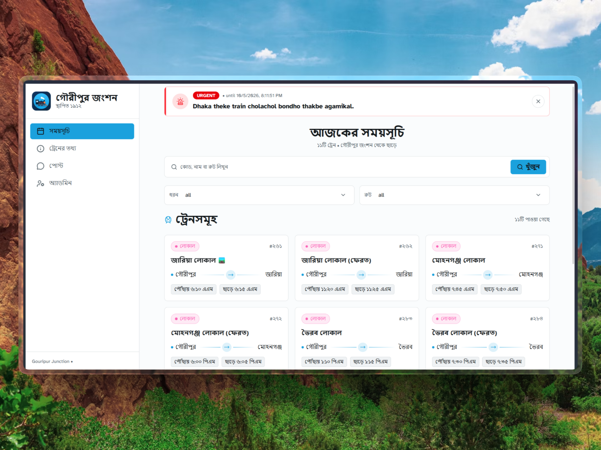

<div align="center">

# Gouripur Junction - গৌরীপুর জংশন

Train schedule, train info and community posts for Gouripur Junction railway station (est. 1912).

> 🌐 **Live**: [https://gouripur-junction.vercel.app/](https://gouripur-junction.vercel.app/)



🛠️ Built for my `cousin's FB group`: Gouripur-Junction - Railway-Station-Community

</div>

## Features

- Schedule (home) - searchable by train code, name, route
- Train info
- Post feed - admin posts directly, public posts need admin approval
- Admin login (JWT in httpOnly cookies, refresh via middleware)

## Tech

Next.js 16, React 19, TailwindCSS + ShadCN, Mongoose, `jose` for JWT.

## Run

```bash
bun install
bun dev
```

## Env

```bash
ADMIN_USERNAME=admin
ADMIN_PASSWORD=admin
JWT_SECRET=change-me
MONGODB_URI=mongodb://127.0.0.1:27017/gouripur-junction
```

Env is accessed only via `lib/env.ts` - never import `process.env` directly.
